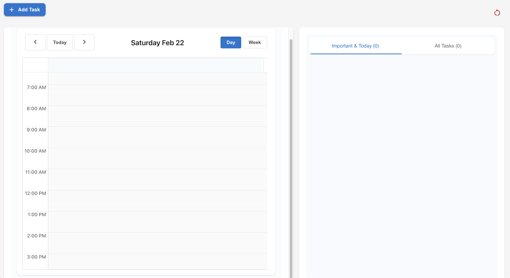

# Task Planner Pro

A modern, intuitive task management and scheduling application built with React and Material-UI.

## Features

- **Task Management**
  - Create, edit, and delete tasks
  - Set task priority (P1-P4)
  - Mark tasks as important or urgent
  - Add task duration
  - Tag tasks (Work, Personal, Study, Health)
  - Mark tasks as complete

- **Calendar Integration**
  - Drag and drop tasks to schedule
  - Visual calendar interface
  - Resize tasks to adjust duration
  - Week and day views
  - Auto-scrolls to current time

- **Smart Organization**
  - Filter tasks by priority and tags
  - Separate views for important/today tasks
  - Persistent storage (tasks save locally)
  - Intuitive drag-and-drop interface

- **User Experience**
  - Clean, modern interface
  - Responsive design
  - Smooth animations
  - Quick task creation
  - Professional color scheme

## Getting Started

### Prerequisites
- Node.js (v14 or higher)
- npm or yarn

### Installation

1. Clone the repository
git clone https://github.com/yourusername/task-planner-pro.git

2. Install dependencies
cd task-planner-pro
npm install

3. Start the development server
npm start

The application will open in your default browser at `http://localhost:3000`

## Usage

1. **Creating Tasks**
   - Click the "+" button to add a new task
   - Fill in task details (name, duration, priority)
   - Set importance and urgency as needed

2. **Scheduling Tasks**
   - Drag tasks from the task list to the calendar
   - Click on calendar to create tasks directly
   - Drag task edges to adjust duration

3. **Managing Tasks**
   - Check the checkbox to mark tasks complete
   - Use filters to organize your view
   - Important tasks appear in a separate section

## Technologies Used

- React
- Material-UI
- React Big Calendar
- React Beautiful DnD
- Date-fns

## Contributing

Contributions are welcome! Please feel free to submit a Pull Request.

## License

This project is licensed under the MIT License - see the [LICENSE](LICENSE) file for details.

## Acknowledgments

- Material-UI for the component library
- React Big Calendar for the calendar implementation
- All contributors and supporters of the project
image.png

## deploy oode: 
firebase deploy --only hosting:flowplanner;  