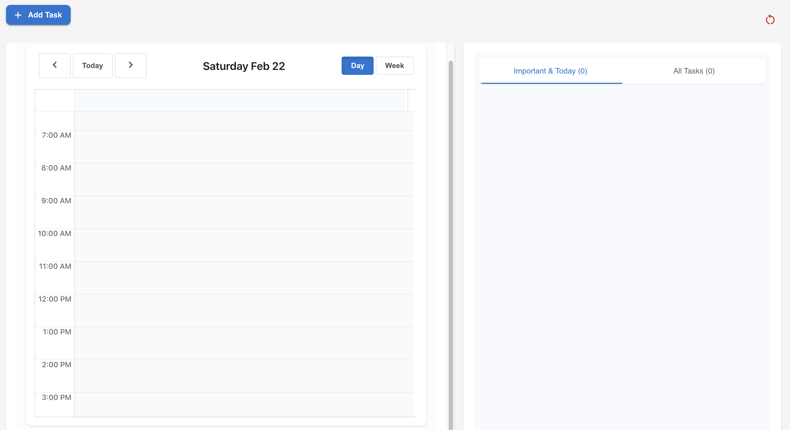
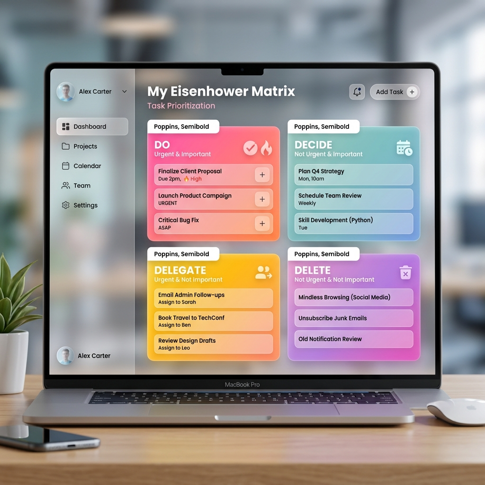
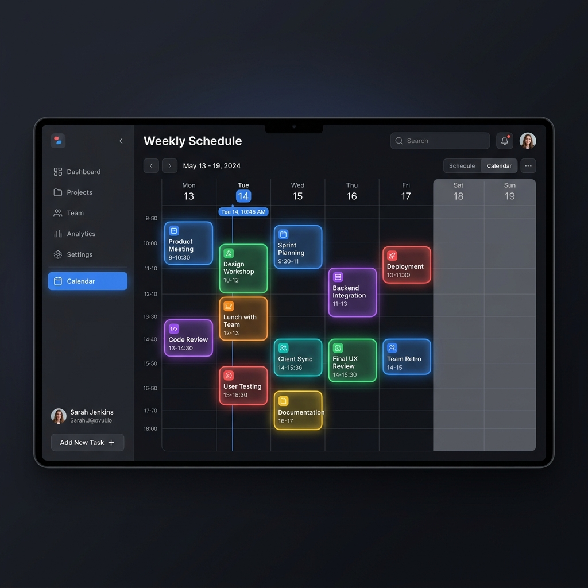
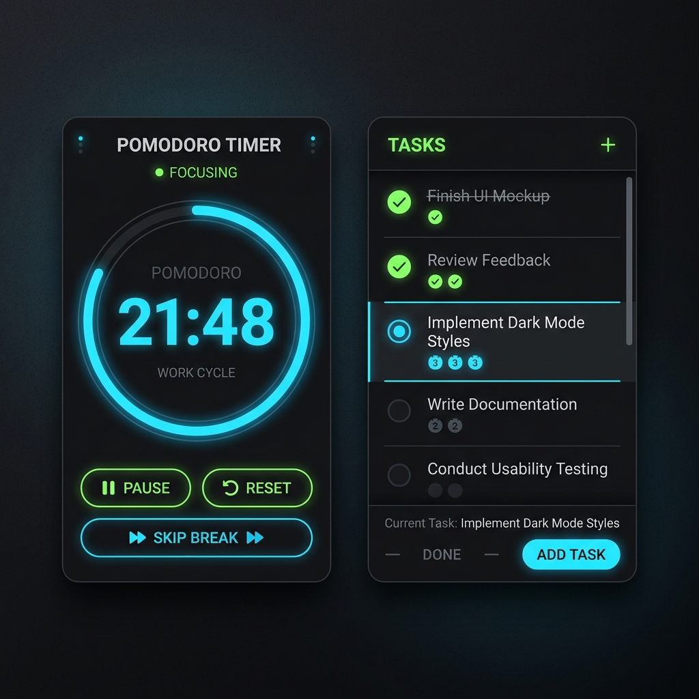
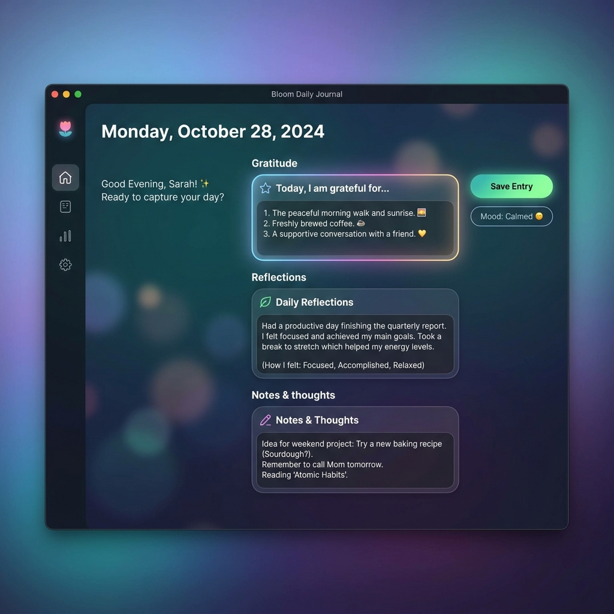

# Flow Planner 🌊

A modern, intuitive, and comprehensive task management and scheduling application designed to help you organize your life, boost productivity, and focus on what matters. Built with React and Material-UI.



---

## ✨ Features and Capabilities

### 1. Advanced Task Management (Eisenhower Matrix & Priority Reordering)
Stop relying on simple checklists. Flow Planner integrates an interactive **Eisenhower Matrix** allowing you to categorize your tasks based on urgency and importance.
- **Priority Columns**: Prioritize what needs to be done *now*, schedule the rest, delegate, or eliminate tasks holding you back.
- **High-Performance Same-List Reordering**: Drag-and-drop to reorder tasks directly within the same priority column. Powered by an atomic batch-updating mechanism, order updates are saved to Firestore in parallel without any layout lag or excessive React re-renders.



### 2. Comprehensive Calendar & Planners 
Visualize your timeline perfectly. Whether you are planning your year, mapping your month, organizing the week, or diving deep into daily routines:
- **Weekly & Day Views**: Drag-and-drop mechanics to seamlessly schedule unscheduled tasks directly on the calendar.
- **Resize and Adjust**: Adjust task durations directly on the calendar.
- **Auto-scroll**: Immediately drops you into the current time so you can manage the "now".



### 3. Focus & Productivity (Pomodoro Timer & Always-On-Top Widget)
Integrated directly into the planner, Flow Planner features a comprehensive, state-of-the-art floating Pomodoro mechanism:
- **Always-On-Top Widget**: Pop out a compact always-on-top mini widget using the native **Document Picture-in-Picture API**. Keep your current primary & secondary focus tasks and live timer countdown visible over all other desktop applications.
- **Live Tab Timer**: The browser tab title dynamically ticks down (e.g., `🍅 24:59 — Flow Planner`) so you can track your state even when the browser is minimized.
- **System Notifications**: Triggers system-level desktop notifications on complete so you never miss a transition.



### 4. Wellness, Gratitude & Relapse Journals
Productivity is more than just getting things done. Maintain healthy mindsets and habits:
- **Daily Reflection Journal**: Assess how your day went and how you can naturally improve tomorrow.
- **Gratitude Journal**: Bring positivity and awareness to parts of your life that mean the most.
- **Habit Tracking**: Advanced tracking sections built intrinsically into the UI.



### 5. Smart Organization & Note-taking
- Comprehensive sticky notes and integrated Markdown note taking features on Tasks.
- Dedicated Important/Today separate views.
- Deep filtering to slice your schedule by tag (Work, Personal, Study, Health).

---

## 🚀 Getting Started

### Prerequisites
- Node.js (v14 or higher)
- npm or yarn

### Installation

1. **Clone the repository**
   ```bash
   git clone https://github.com/yourusername/task-planner-pro.git
   cd task-planner-pro
   ```

2. **Install dependencies**
   ```bash
   npm install
   ```

3. **Start the development server**
   ```bash
   npm start
   ```
   The application will automatically open in your default browser at `http://localhost:3000`.

---

## 💼 Usage Guide

1. **Creating Tasks**
   - Click the "+" button or use the Quick Task Dialog to throw items into your task dump.
   - Define custom parameters: tags, durations, priorities (P1-P4).

2. **Scheduling Tasks**
   - Switch to the Weekly/Day Planner and drag tasks directly onto available timeslots.
   - Resize edges to add buffers or extend the allotted duration dynamically.

3. **Managing Focus**
   - Use the built-in Pomodoro cycles to enforce designated deep-work blocks directly attached to sub-tasks.

---

## 🛠 Technologies Used

- **ReactJS**: Front-end framework.
- **Material-UI (MUI)**: Component library and sleek designs.
- **React Big Calendar**: Core timeline scheduling visualizer.
- **React Beautiful DnD**: Smooth, accessible drag-and-drop interactions.
- **TipTap / React Quill**: Rich-text markup integration for task notes.
- **Date-fns**: Comprehensive edge-case management for recurring schedules.

---

## 🤝 Contributing

Contributions are welcome and appreciated! Please feel free to fork, make modifications, and submit a Pull Request.

---

## 📄 License & Deployment

This project is licensed under the MIT License.

**Deployment (Firebase Hosting)**:
To deploy the application securely via Firebase Hosting:
```bash
npm run deployWebApp
# Or using Firebase CLI directly:
firebase deploy --only hosting:flowplanner
```